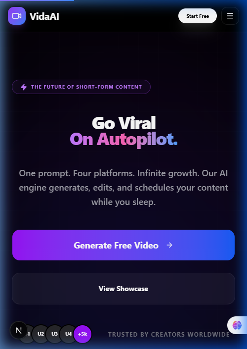
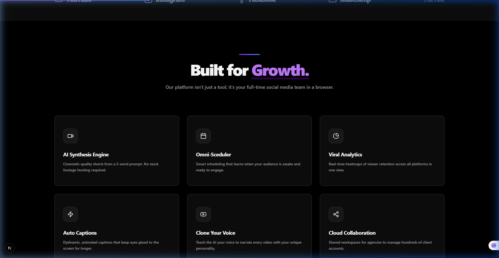

# VidaAI — AI Video Generator & Scheduler


VidaAI is a premium SaaS platform designed to revolutionize video content creation. Using advanced AI, it allows users to generate and auto-schedule high-quality short videos for **YouTube, Instagram, Facebook, and Email**.

## ✨ Key Features

- **🚀 Go Viral on Autopilot**: One prompt, multiple platforms, infinite growth.
- **🎥 AI Video Generation**: Transform text prompts into stunning visual content instantly.
- **📅 Smart Scheduler**: Plan and automate your content calendar across all major social networks.
- **📱 Fully Responsive**: A seamless, high-end experience from 8K monitors to ultra-narrow mobile devices.
- **💎 Premium Design**: Built with a sleek dark aesthetic, glassmorphism, and dynamic animations.

## 🛠️ Tech Stack

- **Framework**: [Next.js 15+](https://nextjs.org/) (App Router)
- **Styling**: [Tailwind CSS](https://tailwindcss.com/)
- **Components**: [Shadcn UI](https://ui.shadcn.com/)
- **Icons**: [Lucide React](https://lucide.dev/)
- **Animations**: [Framer Motion](https://www.framer.com/motion/) & CSS keyframes

## 📱 Mobile Optimized

VidaAI features a custom-built mobile navigation system with a sleek glassmorphism menu, ensuring your dashboard is always accessible on the go.



## 🎨 Professional Layout

Every section, from the feature cards to the comprehensive footer, is crafted with a focus on visual excellence and conversion.



## 🚀 Getting Started

First, run the development server:

```bash
npm run dev
# or
yarn dev
# or
pnpm dev
# or
bun dev
```

Open [http://localhost:3000](http://localhost:3000) with your browser to see the result.

## 📄 License

Built with ❤️ for [Vaidiasri](https://github.com/Vaidiasri).
